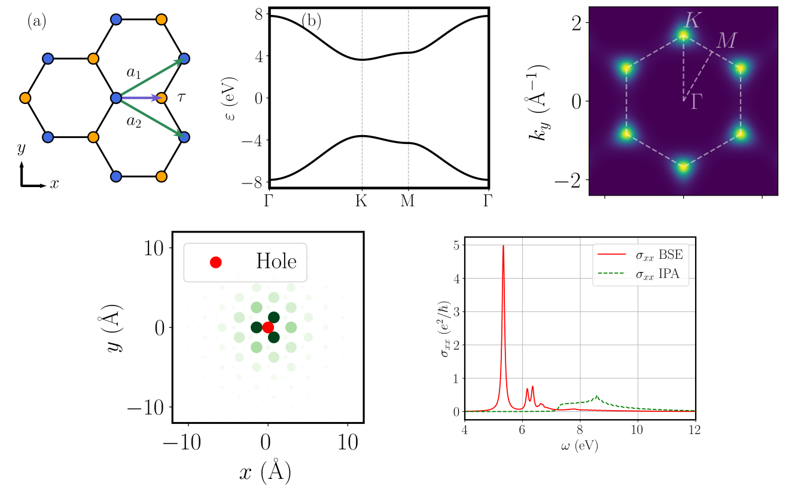

# Xatu
## Introduction
Xatu is a program and library designed to solve the **Bethe-Salpeter equation** (BSE) of any material. Starting with electronic band structures from either tight-binding or DFT based on local orbitals, the BSE is constructed. Its diagonalization then yields the exciton spectrum, which can then be postprocessed to characterize the excitons and their optical properties.

<p align="center">
  
</p>

## Installation
Xatu is built upon the Armadillo C++ library for linear algebra, which is also based on the standard libraries por linear algebra, namely BLAS, LAPACK and ARPACK.
### Ubuntu 22.04 LTS native and WSL
Install the required libraries:
```
sudo apt-get install libopenblas-dev liblapack-dev libarpack-dev libarmadillo-dev
```

The library (```libxatu.a```) can be automatically built running the following command:
```
make build
```

Then, the Xatu binary is built running:
```
make xatu
```

Alternatively, one can define scripts that make use of the functions defined in the library. To compile them, it suffices to put the script in the ```/main```folder and run
```
make [script]
```

### MacOS
For MacOS the dependencies can be installed via ```brew```. To build the library it is recommended to use brew's ```gcc``` compiler instead of ```clang```.
```
brew install gcc openblas lapack arpack armadillo
```

Then, specify in the Makefile the new compiler as well as the location of the libraries:
```
CC = g++-13
INCLUDE = -I$(PWD)/include -I/opt/homebrew/include -I/opt/homebrew/opt/openblas/include
LIBS = -DARMA_DONT_USE_WRAPPER -L$(PWD) -L/opt/homebrew/lib -L/opt/homebrew/opt/openblas/lib -lxatu -larmadillo -lopenblas -llapack -fopenmp -lgfortran -larpack
```

### General
In case that the libraries are not available through repositories, it is always possible to manually download and compile them. For specific instructions on how to install each library we refer to the documentation provided by each of these libraries. For instance, for Armadillo:

Clone the Armadillo library repository:
```git clone https://gitlab.com/conradsnicta/armadillo-code.git```

To install Armadillo run:
```
cd armadillo-code
cmake .
make install
```

Once they are compiled, to link the libraries we have to modify the Makefile to specify the directories where they are installed (e.g. Armadillo and OpenBLAS):
```
INCLUDE = -I/dir/armadillo/include -I/another_dir/OpenBLAS/include/
LIBS = -L/another_dir/OpenBLAS/lib
```

## Documentation
The documentation for the library is generated using Doxygen. To build it, we have to install Doxygen and then run from the ```/docs```folder:
```
doxygen docs.cfg
```

The documentation can be accessed then in ```/docs/html```, by opening ```index.html```.
